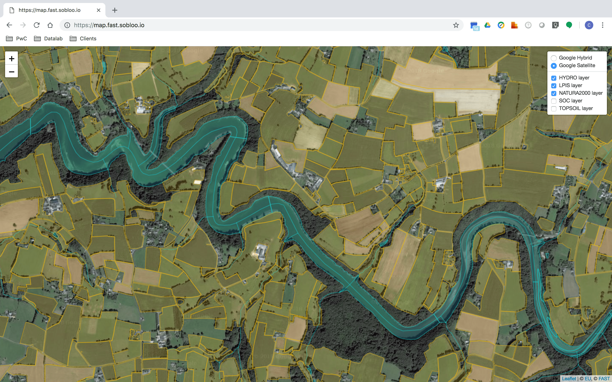

# FaST tile-server

The **FaST tile-server** dynamically retrieves GeoJSON features from several data layers within the bounding box area of a requested tile, and slices it on the fly into a Mapbox vector tile encoded as Google Protobufs.
GeoJSON features are currently retrieved from MongoDB collections. The use of a geospatial index is mandatory to ensure good performance of the overall tile processing (~200 ms). Latency actually depends on the zoom level and the number of GeoJSON features retrieved per tile.

The tile-server is developed in Node.js, scalable and highly available. It also serves a Leaflet map displaying all the available vector layers (LPIS, hydrology, Natura2000, Soil Organic Content, TOPSOIL).



## Install & deployment

### Docker

The actions of building, tagging and publishing Docker images can be performed using the provided Makefiles in the ```webapp```directory.

Execute the following bash commands:
1. ```make build``` to build the container image
2. ```make tag``` to tag the newly built container image
3. ```make publish``` to publish the container image on your own Docker repository.

The repository, name and tag of each Docker container image can be overridden using the environment variables DOCKER_REPO, IMAGE_NAME and IMAGE_TAG:
```bash
$> make DOCKER_REPO=index.docker.io IMAGE_NAME=eufast/tile-server IMAGE_TAG=0.1.0 tag
```

### Kubernetes

A basic configuration is provided and works as is. Don't forget to update the configuration according to your environment (ex: the number of replicas, docker images and ingress settings).


```yaml
apiVersion: extensions/v1beta1
kind: Deployment
metadata:
  name: tile-server
  namespace: fast-platform
  labels:
    platform: fast
    module: core
    domain: gis
    app: tile-server
spec:
  replicas: 3
  template:
    metadata:
      labels:
        platform: fast
        module: core
        domain: gis
        app: tile-server
    spec:
      containers:
      - name: server
        image: eufast/tile-server:0.1.0
        imagePullPolicy: Always
        ports:
        - containerPort: 3000
          protocol: TCP
        resources:
          requests:
            cpu: 100m
            memory: 256Mi
          limits:
            cpu: 2
            memory: 2Gi
        env:
        - name: MONGODB_HOST
          value: mongodb.mongodb
        - name: TARGET_DB
          value: fast
        - name: LPIS_COLLECTION
          value: lpis
        - name: SOC_COLLECTION
          value: soc
        - name: HYDRO_COLLECTION
          value: hydro
        - name: NATURA2000_COLLECTION
          value: natura2000
        - name: TOPSOIL_COLLECTION
          value: topsoil
        - name: FRONTEND_URL_PREFIX
          value: /
        livenessProbe:
          httpGet:
            path: /healthz
            port: 3000
            scheme: HTTP
          initialDelaySeconds: 1
          periodSeconds: 5
        readinessProbe:
          httpGet:
            path: /healthz
            port: 3000
            scheme: HTTP
          initialDelaySeconds: 1
          periodSeconds: 5
```

To deploy the pipeline on Kubernetes, apply YAML manifests located at the root folder of the repository:

```bash
$> kubectl create -f .
```

Then check the status of Kubernetes pods:

```bash
$> kubectl -n fast-platform get pod -l module=core,domain=gis,app=tile-server --show-all

NAME                           READY     STATUS    RESTARTS   AGE
tile-server-58bd6f967f-49zlc   1/1       Running   0          3m
tile-server-58bd6f967f-4qlgx   1/1       Running   0          3m
tile-server-58bd6f967f-fdx8p   1/1       Running   0          57s
```
